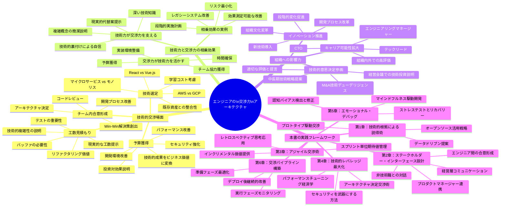
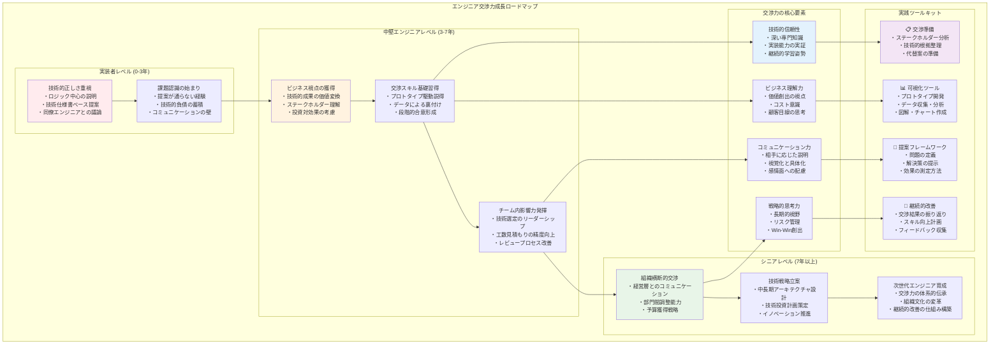

# はじめに：なぜエンジニアこそ交渉力が必要か

## あなたの提案が通らない本当の理由

「技術的には正しいのに、なぜ採用されないのか」

これは多くのエンジニアが抱える共通の悩みである。最新のアーキテクチャを提案しても却下され、技術的負債の解消を訴えても予算がつかない。セキュリティリスクを説明しても「そこまでする必要があるのか」と疑問視される。

問題は、あなたの技術力にあるのではない。技術的な正しさを、相手が理解し納得できる形で伝える「交渉力」が不足しているのである。

## エンジニアが直面する交渉場面

現代のエンジニアは、コードを書く時間と同じくらい、人と対話する時間が増えている。日々の業務で直面する交渉場面を振り返ってみよう。

### 技術選定の場面
新しいプロジェクトでReactかVue.jsかを選ぶ。マイクロサービスにするかモノリスで始めるか。クラウドベンダーはAWSかGCPか。これらの決定は純粋に技術的な問題ではない。チームの学習コスト、既存資産との整合性、将来の拡張性など、多角的な視点からの説得が必要である。

### 工数見積もりの場面
「この機能、来週までにできるよね？」という要求に対して、現実的な工数を提示する。しかし「なぜそんなに時間がかかるのか」と問われたとき、技術的複雑性を非エンジニアに理解してもらうことは容易ではない。バッファの必要性、テストの重要性、リファクタリングの価値を、相手の言葉で説明する必要がある。

### 予算獲得の場面
パフォーマンス改善、セキュリティ強化、開発環境の改善。これらは直接的な売上に結びつかないため、投資対効果の説明が求められる。「レスポンスタイムが0.5秒短縮される」という技術的成果を、「コンバージョン率が3%向上し、年間売上が1,000万円増加する」というビジネス価値に変換する必要がある。

### チーム内での合意形成
コードレビューでの設計議論、アーキテクチャの方向性決定、開発プロセスの改善提案。技術者同士でも、経験や価値観の違いから意見が対立することは多い。論理的な議論だけでなく、相手の懸念を理解し、Win-Winの解決策を見出す交渉力が求められる。

## 技術力と交渉力の相乗効果

優れたエンジニアは、技術力だけでなく交渉力も併せ持っている。両者は対立する概念ではなく、相乗効果を生み出す補完的なスキルである。

### 技術力が交渉力を支える
深い技術知識があるからこそ、複雑な概念を簡潔に説明できる。実装の詳細を理解しているからこそ、現実的な代替案を提示できる。技術的な裏付けがあるからこそ、自信を持って提案できる。

### 交渉力が技術力を活かす
どんなに優れた技術的解決策も、実装されなければ価値を生まない。交渉力によって予算を獲得し、時間を確保し、チームの協力を得ることで、技術力を最大限に発揮できる環境を作り出せる。

### 相乗効果の具体例
あるシニアエンジニアは、レガシーシステムのリファクタリングを提案する際、単に「技術的負債を解消すべき」と主張するのではなく、以下のアプローチを取った。

1. 現在の保守コストを定量化（月間40時間の緊急対応）
2. リファクタリング後の削減効果を試算（月間10時間に削減）
3. 段階的な実施計画を提示（リスクを最小化）
4. 最初の1ヶ月で効果測定可能な小さな改善から着手

結果として、経営層の承認を得て、6ヶ月のリファクタリングプロジェクトが始動した。技術力と交渉力の組み合わせが、組織に大きな価値をもたらした実例である。

## エンジニアの交渉力が組織を変える

交渉力を身につけたエンジニアは、単なる実装者から、技術戦略の推進者へと進化する。組織における影響力が増し、より大きな課題に取り組む機会を得られる。

### 技術的意思決定への参画
経営会議で技術投資の必要性を説明し、中長期的な技術戦略を提案する。M&Aにおける技術デューデリジェンスで、適切な評価と提言を行う。これらは高度な交渉力なしには実現できない。

### イノベーションの推進
新技術の導入、開発プロセスの改革、組織文化の変革。これらのイノベーションは、技術的な正しさだけでは実現しない。関係者の不安を解消し、段階的な変化を促し、小さな成功を積み重ねる交渉力が必要である。

### キャリアの可能性拡大
テックリード、エンジニアリングマネージャー、CTO。技術者としてのキャリアパスは多様化している。どの道を選んでも、交渉力は必須のスキルである。技術力と交渉力を兼ね備えたエンジニアは、組織内外で高く評価される。

## 本書の使い方とロードマップ

本書は、エンジニアの思考パターンと業務フローに即した交渉術を体系的に解説する。抽象的な理論ではなく、明日から使える実践的な手法を提供する。

### 本書の構成
第1章では、技術的根拠を説得力に変換する手法を学ぶ。プロトタイプやデータを活用した具体的な説得術を習得する。

第2章では、相手に応じたコミュニケーション設計を扱う。経営層、プロダクトマネージャー、他のエンジニア、非技術職など、ステークホルダーごとの最適なアプローチを理解する。

第3章では、アジャイル開発の考え方を交渉に応用する。段階的な合意形成と継続的な信頼構築の手法を学ぶ。

第4章では、技術的な強みを交渉における優位性に変える方法を探る。アーキテクチャ、セキュリティ、パフォーマンスといった技術要素を、ビジネス価値として表現する技術を習得する。

第5章では、交渉における感情面の課題に対処する。エンジニア特有の認知バイアスを理解し、冷静で建設的な交渉を実現する方法を学ぶ。

第6章では、交渉を体系的なプロセスとして捉え、準備から実行、フォローアップまでの一連の流れを最適化する手法を提供する。

### 効果的な読み方
本書は、最初から順番に読むことを推奨する。ただし、特定の課題に直面している場合は、該当する章から読み始めても構わない。各章は独立して理解できるよう構成されている。

実践を重視する読者は、各章末のチェックリストやテンプレートを活用することで、すぐに業務に適用できる。理論的背景を深く理解したい読者は、各節の「なぜ」の説明に注目すると良い。

### 継続的な学習
交渉力は、一朝一夕に身につくものではない。本書の内容を実践し、結果を振り返り、改善を重ねることで、着実に向上する。GitHubリポジトリ（negotiation-for-engineers）では、追加のリソースやコミュニティでの議論を提供している。

## 技術者としての新たな可能性

優れたコードは、それ自体が美しい。しかし、そのコードが解決する問題の重要性を伝え、必要なリソースを獲得し、チームの協力を得て初めて、真の価値を生み出す。

交渉力は、エンジニアの技術力を増幅する触媒である。本書を通じて交渉力を身につけることで、あなたの技術的なアイデアがより多く実現し、より大きなインパクトを生み出すことができる。

さあ、技術力を説得力に変換する旅を始めよう。あなたの中に眠る交渉力を解き放ち、エンジニアとしての可能性を最大限に引き出す時が来た。

> **この本に登場するコードと図について**
>  
> 本書で紹介する疑似コード（Python / TypeScript / YAML など）や mermaid 図は、交渉の考え方や構造をエンジニアに馴染みのある形で表現するためのメタファです。実際のシステムにそのまま適用することや、細部の実装を暗記することは目的ではありません。クラス名・メソッド名・コメント・図の構造が示している「どのように分解・整理するか」「どの観点で考えるか」に注目して読み進めてください。
