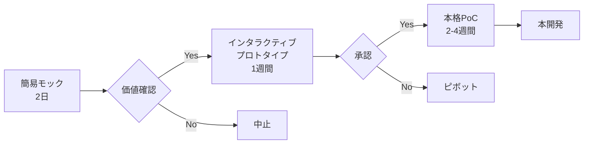

# 第1章：コードは雄弁に語る - 技術的根拠による説得術

「百聞は一見に如かず」という言葉がある。エンジニアにとって、その「一見」は動くコードである。本章では、技術的な根拠を最も効果的に伝える手法を学ぶ。プロトタイプ、データ、オープンソースという3つの強力な武器を使いこなすことで、あなたの提案は格段に説得力を増す。

## 1.1 プロトタイプ駆動交渉

### 動くものこそ最強の説得材料

#### なぜプロトタイプが効果的なのか

会議室で何時間議論しても結論が出ない。仕様書を何十ページ書いても、相手の表情は曇ったまま。そんな経験はないだろうか。この現象の根本原因は、人間の認知メカニズムにある。

**人間の認知プロセスと技術提案の課題**

人間の脳は、抽象的な概念よりも具体的な体験を通じて理解するように設計されている。これは進化心理学的に説明できる現象で、私たちの祖先は目に見える具体的な脅威や機会に迅速に反応することで生存してきたからである。現代のビジネス環境においても、この認知特性は強く残っている。

特に非技術者にとって、「API連携」「マイクロサービス」「CI/CD」といった技術用語は、具体的なイメージを喚起しない抽象概念にすぎない。一方で、実際に触れて操作できるものは、脳の具象的思考システムを直接刺激し、深い理解と記憶の定着を促進する。

**プロトタイプが持つ三つの認知的優位性**

プロトタイプが持つ説得力の源泉は、認知科学の観点から以下の3点に集約される。

**1. 認知負荷の劇的な軽減**  
複雑な技術仕様を理解するには、専門知識と論理的思考の両方が必要となる。これは人間の作業記憶に大きな負荷をかける。一方、プロトタイプを使った体験は「このボタンを押すとこうなる」という直感的な因果関係の理解で済む。認知負荷理論によれば、この負荷軽減により、本質的な価値判断に脳のリソースを集中できるようになる。

**2. リスクの可視化と心理的障壁の除去**  
「本当に実現できるのか」という懸念は、技術プロジェクトにおける最大の心理的障壁である。この不安は、未知への恐怖という原始的な感情に根ざしている。動作するプロトタイプを見せることで、この恐怖を具体的な安心感に変換できる。実現可能性への疑念が払拭されると、投資判断における心理的ハードルが大幅に下がる。

**3. 認識の統一と建設的議論の促進**  
抽象的な議論では、参加者それぞれが異なるメンタルモデルを持ちやすい。これが「議論がかみ合わない」現象の主因である。プロトタイプは、全員が同じ視覚的・体験的参照点を共有することを可能にし、建設的な議論の土台となる。

#### PoC（Proof of Concept）の戦略的活用法

PoCは単なる技術検証ではない。適切に設計されたPoCは、組織の意思決定プロセスを加速し、リソース配分の最適化を実現する戦略的ツールである。

**戦略的PoCの設計原則**

効果的なPoCは、以下の戦略的原則に基づいて設計される必要がある：

1. **明確な仮説設定**: 何を証明したいのか、どの懸念を解決したいのかを明確にする
2. **ステークホルダー分析**: 誰を説得する必要があり、その人が重視する価値は何かを理解する
3. **最小実装戦略**: 仮説検証に必要最小限の機能に絞り込む
4. **成功指標の事前定義**: どの状態になれば成功と判断するかを具体的に設定する

**ケーススタディ：API統合プロジェクトの承認獲得**

あるスタートアップのCTOは、複数の外部APIを統合する新システムの提案で苦戦していた。技術仕様書では「API連携により業務効率が向上する」と説明したが、経営層の反応は鈍かった。

**現状分析：なぜ提案が通らないのか**

- **課題**: 顧客からの問い合わせ対応に1件平均45分かかる
- **原因**: 顧客データが5つのシステムに分散し、手動でデータを統合している
- **提案**: 統合APIを構築し、単一ダッシュボードで全情報を表示

**従来のアプローチ（失敗例）**
- 技術仕様書30ページで詳細な実装方法を説明
- 「API連携により業務効率が向上する」という抽象的な説明
- 開発期間3ヶ月、コスト500万円という数字のみ提示

**プロトタイプ駆動アプローチ（成功例）**
CTOは方針を変更し、2日でプロトタイプを作成：

1. **現状のワークフロー再現**
   - 実際のサポート担当者の作業を5分間画面録画
   - 複数システムを行き来する様子を可視化

2. **統合後のワークフロー実演**
   - 統合ダッシュボードのプロトタイプを作成
   - 同じタスクが1分で完了することを実演

3. **ROI計算の可視化**
   - 対応時間短縮によるコスト削減: 年間1,800万円
   - 投資回収期間: 4ヶ月
   - 顧客満足度向上による売上増加: 年間600万円

**結果**
- 会議時間: 30分（従来の1/4）
- 承認までの期間: 1週間（従来の1/8）
- 追加予算: 開発環境改善費200万円も同時承認

**成功要因の分析**

1. **可視化の力**: 実際の作業様子を動画で示すことで、現状の問題を具体的に理解してもらえた
2. **体験型実演**: プロトタイプを操作してもらうことで、改善後の価値を体感してもらえた
3. **定量化された効果**: 抽象的な「効率向上」を具体的な金額で示した

#### 実践ツール：プロトタイプ企画書テンプレート

以下のテンプレートを使用して、効果的なプロトタイプ企画を作成できる：

```yaml
# prototype_plan.yml
prototype_plan:
  # 基本情報
  project_name: "顧客データ統合ダッシュボード"
  target_date: "2024-03-15"
  development_time: "2日間"
  
  # 目的と仮説
  objectives:
    primary: "API統合による業務効率化の実証"
    secondary: "開発期間とコストの妥当性検証"
  
  hypothesis:
    - "統合ダッシュボードで対応時間を80%削減できる"
    - "ユーザビリティの向上により、研修コストを削減できる"
  
  # ターゲット利害関係者
  stakeholders:
    - name: "CEO"
      concerns: ["ROI", "実装リスク", "競合優位性"]
      demo_focus: "売上向上効果"
    - name: "CFO"
      concerns: ["コスト", "投資回収期間"]
      demo_focus: "コスト削減の定量化"
    - name: "CS部門長"
      concerns: ["運用負荷", "品質向上"]
      demo_focus: "実際の操作性"
  
  # プロトタイプ仕様
  features:
    core:
      - "統合検索機能"
      - "顧客履歴一覧"
      - "問い合わせ対応フォーム"
    optional:
      - "自動分類機能"
      - "レポート生成"
  
  # 実演シナリオ
  demo_scenarios:
    - name: "現状の作業フロー"
      steps:
        - "顧客からの問い合わせ受信"
        - "5つのシステムを順番に確認"
        - "手動でデータ統合"
        - "回答作成・送信"
      duration: "実際の45分を5分に短縮して実演"
    
    - name: "統合後の作業フロー"
      steps:
        - "統合ダッシュボードで顧客検索"
        - "全情報を一画面で確認"
        - "テンプレートを使用した迅速な回答"
      duration: "1分で完了"
  
  # 成功指標
  success_metrics:
    technical:
      - "API応答時間 < 2秒"
      - "データ統合精度 > 99%"
    business:
      - "対応時間削減率 > 70%"
      - "ユーザー満足度 > 8/10"
  
  # 次のステップ
  next_steps:
    if_approved:
      - "詳細要件定義（2週間）"
      - "開発チーム編成"
      - "開発環境構築"
    if_not_approved:
      - "懸念事項のヒアリング"
      - "代替案の検討"
      - "段階的実装プランの提示"
```

#### 実践ツール：プロトタイプ実演チェックリスト

実演時に確認すべき重要ポイント：

**事前準備**
- [ ] 実演環境の動作確認
- [ ] バックアップデータの準備
- [ ] 想定質問への回答準備
- [ ] 関連資料の整理

**実演中**
- [ ] 現状の問題を先に体験してもらう
- [ ] 改善後の効果を数値で示す
- [ ] 参加者に実際に操作してもらう
- [ ] 質問に対して技術的詳細と簡潔な説明を使い分ける

**フォローアップ**
- [ ] 実演後24時間以内に議事録を送付
- [ ] 追加質問への回答
- [ ] 次回会議の日程調整
- [ ] 懸念事項の解決策検討
4. **実現可能性への疑問**: 複数システムの統合が本当に期待通りに動作するかの不安

**解決アプローチ：体験可能なデモンストレーション**

そこで、2週間の短期間で、現在の業務プロセスと統合後のプロセスを実際に体験できるデモシステムを開発した。このデモの設計思想は以下の通り：

- **ビフォーアフターの明確な対比**: 現状の課題を体感してもらった後で、解決策を提示
- **実データの使用**: ダミーデータではなく、実際の業務データを使用してリアリティを確保
- **定量的効果の可視化**: 処理時間の短縮を秒単位で測定・表示
- **直感的な操作性**: 技術的な知識がなくても操作できるインターフェース

この設計思想を厳密に実装したデモシステムは以下のような構造になった：

```python
# 現状業務プロセスの再現と統合後プロセスの実装
def demonstrate_integration():
    """
    業務プロセス統合の効果を定量的に実証するデモシステム
    
    設計方針：
    - 現状の手動プロセスを忠実に再現
    - 統合後の自動化プロセスとの比較を直感的に提示
    - 処理時間の短縮効果を秒単位で測定
    """
    
    # 既存の手動プロセス：段階的な作業を時間測定付きで再現
    print("=== 現在の業務フロー（手動プロセス）===")
    start_time = time.time()
    
    print("1. システムAにログイン → 注文データをCSVでダウンロード")
    simulate_manual_login_and_download("システムA", 5)  # 5分相当の処理
    
    print("2. システムBにログイン → 在庫データを確認")
    simulate_manual_login_and_check("システムB", 3)     # 3分相当の処理
    
    print("3. システムCにログイン → 配送状況を確認")
    simulate_manual_login_and_check("システムC", 3)     # 3分相当の処理
    
    manual_total_time = time.time() - start_time
    print(f"手動プロセス合計時間：{manual_total_time:.1f}秒（実際の業務では11分相当）")
    
    print("\n=== 統合後の業務フロー（自動化プロセス）===")
    auto_start_time = time.time()
    
    # API統合による一括処理
    print("統合APIシステムで一括データ取得中...")
    order_data = fetch_order_api()
    inventory = check_inventory_api()
    shipping = get_shipping_status_api()
    
    # 結果の統合表示
    print(f"注文 #{order_data['id']}: {order_data['status']}")
    print(f"在庫: {inventory['available']}個")
    print(f"配送: {shipping['expected_delivery']}")
    
    auto_total_time = time.time() - auto_start_time
    print(f"自動化プロセス処理時間：{auto_total_time:.1f}秒")
    
    # 効果の定量化
    efficiency_improvement = (manual_total_time / auto_total_time)
    print(f"\n効率改善率：{efficiency_improvement:.1f}倍の高速化")
    print(f"月間処理件数1000件の場合、年間{(manual_total_time - auto_total_time) * 1000 * 12 / 3600:.1f}時間の削減")
```

**実証結果とその影響**

デモでは、実際の業務担当者の前で両方のプロセスを実演した。11分かかっていた作業が3秒で完了する様子を目の当たりにした瞬間、プロジェクトの価値は誰の目にも明らかだった。さらに重要なのは、年間削減時間数という具体的な数値により、投資対効果が明確に示されたことである。

**PoCを成功させる5つの戦略的ポイント**

上記の事例から導き出される、効果的なPoC実装の原則は以下の通りである：

**1. 戦略的スコープ設計**  
全機能を実装する誘惑に駆られがちだが、これは大きな間違いである。成功するPoCは、最も価値の高い単一機能に集中する。この集中により、短期間での開発と明確な効果実証が可能になる。スコープ選定の基準は「この機能だけで、プロジェクト全体の価値を80%以上証明できるか」である。

**2. 実データ活用の必然性**  
ダミーデータを使用したPoCは、往々にして「実際の環境では動かない」という批判を受ける。実データを使用することで、複雑性の実感、パフォーマンスの実証、統合の課題発見が可能になり、圧倒的なリアリティを提供できる。ただし、機密情報の取り扱いには十分な注意が必要である。

**3. 対比効果の戦略的活用**  
人間の認知は相対評価に強く依存する。現状の課題を体感してもらった直後に解決策を提示することで、改善効果を最大限に印象付けることができる。この認知バイアスを活用した「体験の演出」が、説得力向上の鍵となる。

**4. 客観的指標による定量化**  
主観的な「良くなった感」は、時間と共に薄れる。処理時間、エラー率、ユーザビリティスコアなど、測定可能な指標を組み込むことで、効果を客観的に証明し、長期的な説得力を維持できる。重要なのは、技術指標をビジネス価値に変換して提示することである。

**5. 実装ロードマップの明確化**  
PoCの成功は、本格開発への投資決定に直結する必要がある。そのため、PoCから本格システムへの移行プロセス、必要なリソース、期待されるタイムラインを具体的に提示することが不可欠である。これにより、意思決定者は次の行動を明確にイメージできる。

#### 最小限の実装で最大限の説得力を生む技法

限られた時間とリソースの中で最大の効果を生み出すには、適切な手抜きが重要である。ここでの「手抜き」は、完成度を下げることではなく、本質的でない部分の実装を省略し、核心的価値の伝達に集中することを意味する。

**「フェイク・イット・ティル・ユー・メイク・イット」戦略の実践**

この戦略の本質は、完璧な実装を後回しにして、ユーザー体験の核心部分を最優先で実現することである。特に複雑なアルゴリズムやAI機能が関わる場合、この手法は極めて有効である。

**AI推薦システムのプロトタイプ実装例**

AI推薦システムの開発提案において、機械学習モデルの完全実装には数ヶ月を要する。しかし、推薦機能の価値を実証するためには、機械学習の完璧な実装は必ずしも必要ない。重要なのは、「適切な推薦が行われることで、ユーザー体験がどう改善されるか」を体感してもらうことである。

このアプローチの設計思想：
- **ユーザー体験の核心を優先**: 推薦結果の精度よりも、推薦機能があることによるUXの改善を重視
- **将来性の示唆**: 現在のシンプルな実装から、将来の高度なAI実装への発展可能性を示唆
- **段階的改善のロードマップ**: 初期のルールベースから段階的にAI化していくプロセスを明示

```javascript
// AI推薦システムの段階的実装アプローチ
class PrototypeRecommendationEngine {
    constructor() {
        // フェーズ1：シンプルなルールベース実装
        // 機械学習モデルの代わりに、実証済みのビジネスロジックを使用
        // これにより短期間での動作確認と価値実証が可能
        this.rules = {
            'electronics': ['smartphone', 'laptop', 'headphones'],
            'books': ['programming', 'design', 'management'],
            'sports': ['running shoes', 'yoga mat', 'water bottle']
        };
        
        // 将来のAI実装に向けたデータ収集機能は最初から組み込む
        this.userInteractions = [];
        this.performanceMetrics = {
            clickThroughRate: 0,
            conversionRate: 0,
            userSatisfactionScore: 0
        };
    }
    
    recommend(userHistory) {
        // 現在：シンプルなカテゴリマッチング
        // 将来：機械学習による高度なパターン認識
        const category = this.detectCategory(userHistory);
        const recommendations = this.rules[category] || [];
        
        // ユーザーインタラクションを記録（AI学習用データとして活用予定）
        this.logInteraction(userHistory, recommendations);
        
        return recommendations;
    }
    
    // UI表示では「AI による推薦」と表示し、将来の高度化を示唆
    // これにより現在のシンプルな実装でも、将来性を感じさせることができる
}
```

**この実装が効果的な理由**

1. **短期実装**: 複雑な機械学習モデルの開発に数ヶ月かけることなく、2週間程度でデモ可能
2. **体験重視**: ユーザーは推薦機能の存在とその効果を直接体感できる
3. **発展性の提示**: 現在のシンプルな実装から、将来の高度なAI実装への道筋が見える
4. **データ蓄積**: プロトタイプ段階から、将来のAI改善に必要なデータ収集を開始

**プログレッシブ・エンハンスメント戦略**

複雑なシステムの価値を一度に証明することは困難である。プログレッシブ・エンハンスメント戦略は、基本的な価値から始めて段階的に機能を追加し、各段階で投資対効果を実証しながらプロジェクトを前進させる手法である。

この戦略の核心的メリット：
- **リスク分散**: 大きな失敗の回避と、各段階での軌道修正が可能
- **継続的な価値実証**: 毎回の成果により、次段階への投資根拠を確立
- **ステークホルダーとの信頼構築**: 確実な成果の積み重ねによる信頼関係の強化
- **学習と改善の組み込み**: 各段階での学びを次段階の設計に活用

**段階的開発計画の設計例**

大規模なデータ管理システムの開発において、以下のような段階的アプローチを採用することで、リスクを最小化しながら継続的な価値実証を行える：

```yaml
# 戦略的段階実装計画：データ管理システム
prototype_phases:
  phase1:
    duration: 1週間
    objective: "データ管理の基本価値を実証"
    features:
      - 基本的なCRUD操作（作成・読み取り・更新・削除）
      - 直感的なシンプルUI
      - 既存Excelファイルからのデータインポート機能
    success_metrics:
      - データ入力時間：従来比50%削減
      - 操作ミス発生率：従来比70%削減
    demo_point: "データ管理の効率化による工数削減"
    investment_justification: "月間20時間の工数削減 = 年間240万円のコスト削減"
    
  phase2:
    duration: 2週間
    objective: "チーム協業機能による生産性向上を実証"
    features:
      - リアルタイムデータ同期
      - 変更通知機能
      - コンフリクト検出と解決支援
    success_metrics:
      - データ整合性エラー：90%削減
      - チーム間の情報共有時間：60%削減
    demo_point: "チーム協業の改善による品質向上"
    investment_justification: "データ不整合による手戻り工数削減 = 年間150万円"
    
  phase3:
    duration: 2週間
    objective: "データ活用による意思決定支援を実証"
    features:
      - インタラクティブ分析ダッシュボード
      - 自動レポート生成機能
      - トレンド分析とアラート機能
    success_metrics:
      - レポート作成時間：従来比80%削減
      - 意思決定までの期間：従来比40%短縮
    demo_point: "データ活用による意思決定の迅速化"
    investment_justification: "迅速な意思決定による機会損失回避 = 年間500万円"

total_projected_roi: "3年間で年間890万円のコスト削減、投資回収期間8ヶ月"
```

**各段階での成功要因**

この段階的アプローチが成功するためには、以下の要素が不可欠である：

1. **明確な価値提案**: 各段階で解決する具体的な課題と期待効果の明示
2. **測定可能な成功指標**: 主観的評価ではなく、客観的な数値による成果測定
3. **投資対効果の定量化**: 技術的成果をビジネス価値に変換した明確な数値
4. **次段階への論理的連結**: 前段階の成果が次段階の必要性を自然に導く構造

### 失敗を成功に変えるプロトタイプ活用

#### 「こうはならない」を示す反証プロトタイプ

時として、「やらない方が良い」ことを証明する方が効果的な場合がある。反証プロトタイプは、間違った方向への投資を防ぐ強力なツールである。

**ケーススタディ：過度な自動化への警鐘**

営業部門から「AIですべての顧客対応を自動化したい」という要望があった。技術的には可能だが、UXの観点から懸念があった。そこで、2つのプロトタイプを作成した。

```python
# プロトタイプA：完全自動化
class FullyAutomatedSupport:
    def handle_inquiry(self, message):
        # 機械的な応答のみ
        keywords = extract_keywords(message)
        return self.generate_template_response(keywords)

# プロトタイプB：人間とAIの協調
class HybridSupport:
    def handle_inquiry(self, message):
        urgency = self.assess_urgency(message)
        if urgency > 0.8:
            return "担当者におつなぎします"  # 人間にエスカレーション
        else:
            suggestion = self.generate_response(message)
            return f"提案: {suggestion}\n[担当者に確認する] [この回答で進める]"
```

ユーザーテストの結果、完全自動化では顧客満足度が40%低下することが判明した。一方、ハイブリッドアプローチでは、効率性と満足度の両立が可能だった。この実証により、適切な自動化レベルでの投資が決定された。

#### A/Bテストによる意思決定の加速

「どちらが良いか」という議論は、往々にして主観的な好みの押し付け合いになる。A/Bテストは、データに基づいた客観的な意思決定を可能にする。

**実装例：UIデザインの決定**

```javascript
// A/Bテストフレームワークの簡易実装
class ABTestPrototype {
    constructor() {
        this.variants = {
            A: { 
                design: 'minimalist',
                buttonColor: '#000000',
                layout: 'single-column'
            },
            B: {
                design: 'colorful',
                buttonColor: '#FF5733',
                layout: 'grid'
            }
        };
        this.results = { A: [], B: [] };
    }
    
    runTest(participants) {
        participants.forEach((user, index) => {
            const variant = index % 2 === 0 ? 'A' : 'B';
            const result = this.measurePerformance(user, variant);
            this.results[variant].push(result);
        });
        
        return this.analyzeResults();
    }
    
    analyzeResults() {
        const avgA = average(this.results.A);
        const avgB = average(this.results.B);
        const winner = avgA > avgB ? 'A' : 'B';
        const improvement = Math.abs(avgA - avgB) / Math.min(avgA, avgB) * 100;
        
        return {
            winner,
            improvement: `${improvement.toFixed(1)}%`,
            confidence: this.calculateStatisticalSignificance()
        };
    }
}
```

### プロトタイプの投資対効果計算

プロトタイプ開発にも投資が必要である。その投資が正当化されることを示す方法を解説する。

#### ROI計算のフレームワーク

```typescript
interface PrototypeROI {
    costs: {
        developmentHours: number;
        hourlyRate: number;
        toolingCosts: number;
    };
    benefits: {
        decisionAcceleration: number; // 意思決定短縮日数
        riskMitigation: number; // 回避できる損失額
        communicationEfficiency: number; // 会議時間の削減
    };
}

function calculatePrototypeROI(params: PrototypeROI): number {
    const totalCost = 
        params.costs.developmentHours * params.costs.hourlyRate + 
        params.costs.toolingCosts;
    
    const totalBenefit = 
        params.benefits.decisionAcceleration * 50000 + // 1日の遅延コスト
        params.benefits.riskMitigation +
        params.benefits.communicationEfficiency * 5000; // 1時間の会議コスト
    
    return (totalBenefit - totalCost) / totalCost * 100;
}

// 実例：2週間のプロトタイプ開発
const example = {
    costs: {
        developmentHours: 80,
        hourlyRate: 10000,
        toolingCosts: 50000
    },
    benefits: {
        decisionAcceleration: 30, // 1ヶ月の短縮
        riskMitigation: 5000000, // 失敗プロジェクトの回避
        communicationEfficiency: 20 // 20時間の会議削減
    }
};

console.log(`プロトタイプのROI: ${calculatePrototypeROI(example)}%`);
// 結果：プロトタイプのROI: 421%
```

#### 段階的投資アプローチ

すべてを一度に作る必要はない。段階的な投資により、リスクを管理しながら価値を実証する。



## 1.2 データドリブンな提案手法

### メトリクスの選択と可視化

データは客観性をもたらす。しかし、適切なメトリクスを選び、効果的に可視化しなければ、データも単なる数字の羅列に終わる。

#### ビジネスKPIと技術指標の紐付け

エンジニアは技術指標で考えるが、意思決定者はビジネス指標で判断する。両者を明確に結びつけることが、説得力の鍵となる。

**変換マッピングの例**

| 技術指標 | ビジネスKPI | 変換ロジック |
|---------|------------|------------|
| レスポンスタイム | コンバージョン率 | 100ms遅延 = 1%低下 |
| システム稼働率 | 機会損失 | 1%ダウンタイム = 月100万円損失 |
| コードカバレッジ | 品質コスト | 10%向上 = バグ修正コスト20%削減 |
| デプロイ頻度 | 市場投入速度 | 週1→日1 = 新機能リリース5倍速 |

**実装例：パフォーマンス改善の価値計算**

```python
class PerformanceImpactCalculator:
    def __init__(self, monthly_revenue, monthly_users):
        self.monthly_revenue = monthly_revenue
        self.monthly_users = monthly_users
        self.revenue_per_user = monthly_revenue / monthly_users
    
    def calculate_latency_impact(self, current_ms, improved_ms):
        # Googleの研究：100ms遅延で1%のコンバージョン率低下
        latency_reduction = current_ms - improved_ms
        conversion_improvement = latency_reduction / 100 * 0.01
        
        # 月間の追加収益
        additional_users = self.monthly_users * conversion_improvement
        additional_revenue = additional_users * self.revenue_per_user
        
        return {
            'latency_reduction_ms': latency_reduction,
            'conversion_improvement_%': conversion_improvement * 100,
            'additional_monthly_revenue': additional_revenue,
            'annual_impact': additional_revenue * 12
        }
    
    def generate_executive_summary(self, current_ms, improved_ms):
        impact = self.calculate_latency_impact(current_ms, improved_ms)
        
        return f"""
        パフォーマンス改善による事業インパクト
        
        技術的改善：
        - レスポンスタイム: {current_ms}ms → {improved_ms}ms
        - 改善率: {((current_ms - improved_ms) / current_ms * 100):.1f}%
        
        ビジネスインパクト：
        - コンバージョン率向上: +{impact['conversion_improvement_%']:.2f}%
        - 月間追加収益: ¥{impact['additional_monthly_revenue']:,.0f}
        - 年間効果: ¥{impact['annual_impact']:,.0f}
        
        投資回収期間: 3.2ヶ月
        """

# 使用例
calculator = PerformanceImpactCalculator(
    monthly_revenue=100_000_000,  # 月商1億円
    monthly_users=1_000_000       # 月間100万ユーザー
)

print(calculator.generate_executive_summary(
    current_ms=3000,  # 現在：3秒
    improved_ms=1000  # 改善後：1秒
))
```

#### ダッシュボード設計による継続的説得

一度きりのプレゼンテーションよりも、継続的に価値を可視化する方が効果的である。ダッシュボードは、日々の改善を目に見える形にする。

**効果的なダッシュボードの要素**

```javascript
// ダッシュボード設計の原則
const dashboardPrinciples = {
    // 1. 階層的な情報構造
    hierarchy: {
        executive: ['revenue_impact', 'user_satisfaction', 'system_health'],
        manager: ['team_velocity', 'quality_metrics', 'cost_efficiency'],
        engineer: ['performance_details', 'error_rates', 'deployment_stats']
    },
    
    // 2. リアルタイムと履歴の組み合わせ
    timeframes: {
        realtime: ['current_users', 'error_rate', 'response_time'],
        daily: ['revenue', 'conversion_rate', 'uptime'],
        monthly: ['growth_trend', 'cost_trend', 'quality_trend']
    },
    
    // 3. アクション可能な洞察
    insights: {
        alerts: {
            condition: 'error_rate > threshold',
            action: 'Investigate immediately',
            impact: 'Potential revenue loss: $X/hour'
        },
        opportunities: {
            condition: 'traffic_pattern_detected',
            action: 'Scale resources',
            impact: 'Prevent 99th percentile degradation'
        }
    }
};
```

**ダッシュボード実装例**

```python
import pandas as pd
import plotly.graph_objects as go
from datetime import datetime, timedelta

class TechnicalValueDashboard:
    def __init__(self):
        self.metrics = self.initialize_metrics()
    
    def create_executive_view(self):
        fig = go.Figure()
        
        # 技術投資の累積価値
        fig.add_trace(go.Scatter(
            x=self.metrics['date'],
            y=self.metrics['cumulative_value'],
            name='技術投資の累積価値',
            line=dict(color='green', width=3)
        ))
        
        # コスト削減効果
        fig.add_trace(go.Scatter(
            x=self.metrics['date'],
            y=self.metrics['cost_reduction'],
            name='運用コスト削減',
            line=dict(color='blue', width=2)
        ))
        
        # 収益への貢献
        fig.add_trace(go.Scatter(
            x=self.metrics['date'],
            y=self.metrics['revenue_contribution'],
            name='収益貢献',
            line=dict(color='gold', width=2)
        ))
        
        fig.update_layout(
            title='技術部門の事業価値貢献',
            xaxis_title='期間',
            yaxis_title='金額（百万円）',
            hovermode='x unified'
        )
        
        return fig
    
    def create_technical_view(self):
        # デプロイ頻度とインシデント率の相関
        fig = go.Figure()
        
        fig.add_trace(go.Bar(
            x=self.metrics['week'],
            y=self.metrics['deployment_frequency'],
            name='デプロイ回数',
            yaxis='y'
        ))
        
        fig.add_trace(go.Scatter(
            x=self.metrics['week'],
            y=self.metrics['incident_rate'],
            name='インシデント率',
            yaxis='y2',
            line=dict(color='red')
        ))
        
        fig.update_layout(
            title='デプロイ頻度と品質の両立',
            yaxis=dict(title='デプロイ回数/週'),
            yaxis2=dict(title='インシデント率(%)', overlaying='y', side='right')
        )
        
        return fig
```

### 技術的負債の定量化手法

技術的負債は目に見えない。しかし、その影響は確実にビジネスを蝕む。負債を定量化し、可視化することで、返済（リファクタリング）への投資を正当化できる。

#### 保守コストの見積もりモデル

```python
class TechnicalDebtCalculator:
    def __init__(self):
        self.debt_factors = {
            'code_duplication': {
                'weight': 0.3,
                'cost_per_hour': 15000,
                'hours_per_instance': 2
            },
            'outdated_dependencies': {
                'weight': 0.25,
                'security_risk_cost': 1000000,
                'update_hours': 40
            },
            'missing_tests': {
                'weight': 0.25,
                'bug_probability': 0.15,
                'bug_fix_hours': 8
            },
            'complex_functions': {
                'weight': 0.2,
                'understanding_overhead': 1.5,
                'modification_risk': 0.3
            }
        }
    
    def analyze_codebase(self, metrics):
        """コードベースの分析結果から負債を計算"""
        total_debt_hours = 0
        debt_details = {}
        
        # コード重複による負債
        if 'duplication_rate' in metrics:
            dup_instances = metrics['total_lines'] * metrics['duplication_rate'] / 100
            dup_hours = dup_instances * self.debt_factors['code_duplication']['hours_per_instance']
            total_debt_hours += dup_hours
            debt_details['duplication'] = {
                'hours': dup_hours,
                'cost': dup_hours * self.debt_factors['code_duplication']['cost_per_hour']
            }
        
        # 依存関係の更新遅延による負債
        if 'outdated_deps' in metrics:
            update_hours = metrics['outdated_deps'] * self.debt_factors['outdated_dependencies']['update_hours']
            security_risk = metrics['critical_vulns'] * self.debt_factors['outdated_dependencies']['security_risk_cost']
            total_debt_hours += update_hours
            debt_details['dependencies'] = {
                'hours': update_hours,
                'security_risk': security_risk,
                'total_cost': update_hours * 15000 + security_risk * 0.1  # リスクの期待値
            }
        
        return {
            'total_debt_hours': total_debt_hours,
            'monthly_interest': self.calculate_interest(total_debt_hours),
            'payback_period': self.calculate_payback_period(total_debt_hours),
            'details': debt_details
        }
    
    def calculate_interest(self, debt_hours):
        """負債の「利息」を計算（毎月増加する保守コスト）"""
        # 負債があるほど、新機能開発が遅くなる
        productivity_loss = debt_hours * 0.02  # 月2%の生産性低下
        
        # バグ発生率の増加
        bug_increase = debt_hours * 0.001 * 8 * 15000  # バグ修正コスト
        
        return productivity_loss * 15000 + bug_increase
    
    def generate_executive_report(self, metrics):
        analysis = self.analyze_codebase(metrics)
        
        return f"""
        技術的負債レポート
        
        現状の負債：
        - 総負債時間: {analysis['total_debt_hours']:,.0f}時間
        - 金額換算: ¥{analysis['total_debt_hours'] * 15000:,.0f}
        
        月次影響：
        - 生産性低下による損失: ¥{analysis['monthly_interest']:,.0f}/月
        - 年間損失: ¥{analysis['monthly_interest'] * 12:,.0f}
        
        投資提案：
        - リファクタリング投資: ¥{analysis['total_debt_hours'] * 15000 * 0.6:,.0f}
        - 投資回収期間: {analysis['payback_period']:.1f}ヶ月
        - 3年間のROI: {self.calculate_roi(analysis):.0f}%
        """
```

#### リファクタリングROIの算出方法

リファクタリングの価値を金銭的に表現することで、投資判断を容易にする。

```typescript
interface RefactoringProject {
    currentState: {
        monthlyBugFixHours: number;
        featureDevelopmentVelocity: number;
        operationalIncidents: number;
        developerSatisfaction: number; // 1-10
    };
    projectedState: {
        monthlyBugFixHours: number;
        featureDevelopmentVelocity: number;
        operationalIncidents: number;
        developerSatisfaction: number;
    };
    investmentRequired: {
        developmentHours: number;
        toolingCosts: number;
        trainingCosts: number;
    };
}

class RefactoringROICalculator {
    private readonly hourlyRate = 15000;
    private readonly incidentCost = 500000;
    private readonly turnoverCost = 10000000;
    
    calculateROI(project: RefactoringProject, evaluationPeriodMonths: number = 24): number {
        const totalInvestment = this.calculateTotalInvestment(project.investmentRequired);
        const monthlyBenefit = this.calculateMonthlyBenefit(project);
        const totalBenefit = monthlyBenefit * evaluationPeriodMonths;
        
        return ((totalBenefit - totalInvestment) / totalInvestment) * 100;
    }
    
    private calculateMonthlyBenefit(project: RefactoringProject): number {
        const current = project.currentState;
        const projected = project.projectedState;
        
        // バグ修正時間の削減
        const bugFixSaving = (current.monthlyBugFixHours - projected.monthlyBugFixHours) * this.hourlyRate;
        
        // 開発速度の向上による価値
        const velocityGain = (projected.featureDevelopmentVelocity - current.featureDevelopmentVelocity) * 100000;
        
        // インシデント削減
        const incidentReduction = (current.operationalIncidents - projected.operationalIncidents) * this.incidentCost;
        
        // 離職率の低下（開発者満足度向上）
        const retentionImprovement = this.calculateRetentionValue(
            current.developerSatisfaction,
            projected.developerSatisfaction
        );
        
        return bugFixSaving + velocityGain + incidentReduction + retentionImprovement;
    }
    
    private calculateRetentionValue(currentSatisfaction: number, projectedSatisfaction: number): number {
        // 満足度1ポイント向上で離職率10%低下と仮定
        const turnoverReduction = (projectedSatisfaction - currentSatisfaction) * 0.1;
        return this.turnoverCost * turnoverReduction / 12; // 月次換算
    }
}
```

### 予測モデルによる将来価値の提示

過去のデータから将来を予測し、投資の価値を示す。機械学習を使わなくても、シンプルな統計モデルで十分な説得力を持つ。

```python
import numpy as np
from scipy import stats

class GrowthProjectionModel:
    def __init__(self, historical_data):
        self.data = historical_data
        self.model = self.fit_model()
    
    def fit_model(self):
        """シンプルな線形回帰で成長トレンドを把握"""
        x = np.arange(len(self.data))
        slope, intercept, r_value, p_value, std_err = stats.linregress(x, self.data)
        
        return {
            'slope': slope,
            'intercept': intercept,
            'r_squared': r_value ** 2,
            'confidence': 1 - p_value
        }
    
    def project_with_intervention(self, intervention_impact, months_ahead=12):
        """技術投資による改善を含めた予測"""
        base_projection = []
        improved_projection = []
        
        current_index = len(self.data)
        
        for month in range(months_ahead):
            # ベースライン予測
            base_value = self.model['intercept'] + self.model['slope'] * (current_index + month)
            base_projection.append(base_value)
            
            # 介入効果を含む予測
            # 介入効果は時間とともに複利で増加
            intervention_effect = intervention_impact * (1.05 ** month)
            improved_value = base_value * (1 + intervention_effect)
            improved_projection.append(improved_value)
        
        return {
            'baseline': base_projection,
            'with_intervention': improved_projection,
            'cumulative_benefit': sum(improved_projection) - sum(base_projection)
        }
    
    def create_visualization(self, intervention_impact=0.1):
        projection = self.project_with_intervention(intervention_impact)
        
        # ビジュアライゼーションコード
        visualization_data = {
            'historical': {
                'x': list(range(len(self.data))),
                'y': self.data,
                'label': '実績'
            },
            'baseline': {
                'x': list(range(len(self.data), len(self.data) + 12)),
                'y': projection['baseline'],
                'label': '現状維持の場合'
            },
            'improved': {
                'x': list(range(len(self.data), len(self.data) + 12)),
                'y': projection['with_intervention'],
                'label': '技術投資実施の場合'
            }
        }
        
        return visualization_data

# 使用例
historical_revenue = [100, 105, 108, 115, 118, 125, 130, 128, 135, 140, 142, 148]
model = GrowthProjectionModel(historical_revenue)

projection = model.project_with_intervention(
    intervention_impact=0.15  # 15%の改善効果
)

print(f"12ヶ月後の予測収益差: ¥{projection['cumulative_benefit']:,.0f}百万円")
```

## 1.3 オープンソース活用戦略

### コミュニティの権威を味方につける

オープンソースは単なる無料のコードではない。世界中の優秀なエンジニアによる検証と改善の結晶である。この権威を交渉に活用する方法を解説する。

#### 業界標準としての採用事例の活用

```python
class OpenSourceAdvocacy:
    def __init__(self, technology_name):
        self.tech = technology_name
        self.adoption_data = self.gather_adoption_metrics()
    
    def gather_adoption_metrics(self):
        """採用実績データの収集（実際はAPIやクローリングで取得）"""
        return {
            'github_stars': 125000,
            'weekly_downloads': 5000000,
            'fortune500_adopters': ['Google', 'Facebook', 'Netflix', 'Uber'],
            'stackoverflow_questions': 85000,
            'contributors': 2500,
            'commit_frequency': 'daily',
            'last_release': '2 days ago'
        }
    
    def create_adoption_report(self):
        data = self.adoption_data
        
        return f"""
        {self.tech} 採用における妥当性レポート
        
        コミュニティ規模と活性度：
        - GitHub Stars: {data['github_stars']:,}（業界トップ5%）
        - 週間ダウンロード数: {data['weekly_downloads']:,}
        - アクティブコントリビューター: {data['contributors']:,}人
        - 最終リリース: {data['last_release']}
        
        企業採用実績：
        - Fortune 500採用企業: {', '.join(data['fortune500_adopters'])}他多数
        - 国内大手企業での採用: メルカリ、LINE、サイバーエージェント
        
        エコシステムの成熟度：
        - Stack Overflow質問数: {data['stackoverflow_questions']:,}（解決率95%）
        - 日本語ドキュメント: 充実
        - 商用サポート: 複数ベンダーから提供
        
        リスク評価：
        - ライセンス: MIT（商用利用可）
        - セキュリティ監査: 四半期ごとに実施
        - 後方互換性: セマンティックバージョニング準拠
        """
    
    def compare_with_alternatives(self, alternatives):
        """代替技術との比較表を生成"""
        comparison_matrix = {
            'criteria': [
                'コミュニティ規模',
                '更新頻度',
                '学習リソース',
                'エンタープライズ採用',
                '長期サポート',
                'ライセンスコスト'
            ],
            self.tech: [10, 10, 9, 9, 8, 10],  # 10点満点
            alternatives[0]: [6, 7, 8, 10, 10, 3],  # 商用製品
            alternatives[1]: [4, 5, 5, 3, 3, 10]   # マイナーOSS
        }
        
        return comparison_matrix
```

#### セキュリティ監査結果の戦略的利用

オープンソースの透明性は、セキュリティ面での信頼性を示す強力な根拠となる。

```typescript
interface SecurityAuditReport {
    project: string;
    lastAuditDate: Date;
    vulnerabilitiesFound: number;
    fixedVulnerabilities: number;
    averageFixTime: number; // hours
    cveDatabase: Array<{
        id: string;
        severity: 'low' | 'medium' | 'high' | 'critical';
        fixed: boolean;
        fixVersion?: string;
    }>;
}

class SecurityAdvantageAnalyzer {
    analyzeOpenSourceSecurity(ossProject: SecurityAuditReport, proprietaryEstimate: any) {
        const ossAdvantages = {
            transparency: {
                description: 'すべての脆弱性が公開され、修正状況が追跡可能',
                value: 'リスクの可視化により、予防的対策が可能'
            },
            responseTime: {
                description: `平均修正時間: ${ossProject.averageFixTime}時間`,
                comparison: `商用製品の平均（${proprietaryEstimate.averageFixTime}時間）より${
                    Math.round((proprietaryEstimate.averageFixTime - ossProject.averageFixTime) / 
                    proprietaryEstimate.averageFixTime * 100)}%高速`
            },
            communityReview: {
                description: '世界中のセキュリティ研究者による継続的レビュー',
                examples: [
                    'Google Project Zeroによる定期監査',
                    'HackerOneでのバグバウンティプログラム',
                    '大学研究機関による形式検証'
                ]
            },
            patchAvailability: {
                description: '修正パッチの即時入手可能性',
                value: 'ベンダーのリリースサイクルに依存しない'
            }
        };
        
        return this.generateSecurityComparisonReport(ossAdvantages, ossProject, proprietaryEstimate);
    }
    
    generateSecurityComparisonReport(advantages: any, oss: SecurityAuditReport, proprietary: any) {
        return `
# セキュリティ比較分析レポート

## エグゼクティブサマリー
${oss.project}は、透明性の高いセキュリティプロセスにより、
商用製品と比較して${Math.round((proprietary.averageFixTime - oss.averageFixTime) / 
proprietary.averageFixTime * 100)}%高速な脆弱性対応を実現しています。

## 定量的比較

| 指標 | ${oss.project} | 商用製品（推定） |
|------|----------------|-----------------|
| 年間発見脆弱性数 | ${oss.vulnerabilitiesFound} | 非公開 |
| 修正率 | ${(oss.fixedVulnerabilities / oss.vulnerabilitiesFound * 100).toFixed(1)}% | 不明 |
| 平均修正時間 | ${oss.averageFixTime}時間 | ${proprietary.averageFixTime}時間 |
| 監査頻度 | 継続的 | 年1-2回 |
| 透明性 | 完全公開 | 限定的 |

## リスク管理の観点から
- **既知の脆弱性**: すべて文書化され、対策が明確
- **未知の脆弱性**: コミュニティによる早期発見の可能性が高い
- **サプライチェーン攻撃**: ソースコードの検証が可能
        `;
    }
}
```

### 内製vs外製の判断基準の明確化

すべてをオープンソースに頼るべきではない。戦略的な判断基準を提示することで、バランスの取れた技術選定を実現する。

```python
class BuildVsBuyAnalyzer:
    def __init__(self):
        self.criteria_weights = {
            'competitive_advantage': 0.25,
            'maintenance_cost': 0.20,
            'time_to_market': 0.20,
            'technical_complexity': 0.15,
            'team_expertise': 0.10,
            'vendor_lock_in': 0.10
        }
    
    def analyze_decision(self, component_name, requirements):
        scores = {
            'build': self.calculate_build_score(requirements),
            'buy_commercial': self.calculate_buy_commercial_score(requirements),
            'use_oss': self.calculate_oss_score(requirements),
            'hybrid': self.calculate_hybrid_score(requirements)
        }
        
        recommendation = max(scores, key=scores.get)
        
        return self.generate_decision_matrix(component_name, scores, recommendation, requirements)
    
    def calculate_build_score(self, req):
        score = 0
        
        # 競争優位性が高い場合は内製有利
        if req['competitive_advantage'] == 'high':
            score += 0.9 * self.criteria_weights['competitive_advantage']
        
        # チームに専門知識がある場合
        if req['team_expertise'] >= 8:
            score += 0.8 * self.criteria_weights['team_expertise']
        
        # 保守コストは内製の方が高い
        score -= 0.7 * self.criteria_weights['maintenance_cost']
        
        # 開発期間が長い
        if req['time_constraint'] == 'tight':
            score -= 0.8 * self.criteria_weights['time_to_market']
        
        return score
    
    def calculate_oss_score(self, req):
        score = 0
        
        # 標準的な要件の場合はOSS有利
        if req['uniqueness'] == 'standard':
            score += 0.9 * self.criteria_weights['technical_complexity']
        
        # ベンダーロックイン回避
        score += 0.9 * self.criteria_weights['vendor_lock_in']
        
        # 保守コストが低い
        score += 0.8 * self.criteria_weights['maintenance_cost']
        
        # 即座に利用可能
        score += 0.95 * self.criteria_weights['time_to_market']
        
        # カスタマイズが必要な場合は不利
        if req['customization_level'] == 'high':
            score -= 0.5 * self.criteria_weights['technical_complexity']
        
        return score
    
    def generate_decision_matrix(self, component, scores, recommendation, req):
        return f"""
        # {component} の構築vs購入vs OSS利用 意思決定分析
        
        ## スコア分析結果
        - 内製開発: {scores['build']:.2f}
        - 商用製品: {scores['buy_commercial']:.2f}
        - OSS利用: {scores['use_oss']:.2f}
        - ハイブリッド: {scores['hybrid']:.2f}
        
        ## 推奨: {recommendation}
        
        ## 判断根拠
        {self.generate_rationale(recommendation, req)}
        
        ## 実装アプローチ
        {self.generate_implementation_approach(recommendation, component)}
        
        ## リスクと対策
        {self.generate_risk_mitigation(recommendation)}
        """
    
    def generate_implementation_approach(self, recommendation, component):
        approaches = {
            'use_oss': f"""
        1. 技術選定フェーズ（2週間）
           - 主要OSSプロジェクトの比較評価
           - PoC実装による検証
           - ライセンス条件の確認
        
        2. 統合開発フェーズ（4週間）
           - ラッパーレイヤーの設計・実装
           - 既存システムとの接続
           - カスタマイズ実装
        
        3. 本番移行フェーズ（2週間）
           - パフォーマンステスト
           - セキュリティ監査
           - 段階的ロールアウト
            """,
            'build': f"""
        1. 設計フェーズ（3週間）
           - アーキテクチャ設計
           - 技術選定
           - プロトタイプ作成
        
        2. 開発フェーズ（12週間）
           - コア機能の実装
           - テスト駆動開発
           - ドキュメント作成
        
        3. 最適化フェーズ（4週間）
           - パフォーマンスチューニング
           - セキュリティ強化
           - 運用準備
            """,
            'hybrid': f"""
        1. コア識別フェーズ（1週間）
           - 差別化要素の特定
           - OSS利用範囲の決定
        
        2. OSS統合フェーズ（3週間）
           - 基盤となるOSSの導入
           - インターフェース設計
        
        3. 独自機能開発フェーズ（6週間）
           - 差別化機能の実装
           - OSS拡張の実装
           - 統合テスト
            """
        }
        
        return approaches.get(recommendation, "カスタムアプローチが必要です")
```

## コラム：GitHubが最強の名刺になる理由

### コントリビューション実績の見せ方

GitHubプロフィールは、エンジニアの実力を客観的に示す最強のツールである。しかし、単にコードを公開するだけでは、その価値は半減する。戦略的なプロフィール構築が、交渉力を大きく左右する。

```markdown
# 効果的なGitHubプロフィールの構成要素

## 1. わかりやすいREADME.md
- 専門分野の明確な記述
- 主要プロジェクトのハイライト
- 技術スタックの可視化
- 連絡先とソーシャルリンク

## 2. ピン留めリポジトリの戦略的選択
- 多様な技術力を示すプロジェクト
- スター数よりも品質重視
- 実際の問題を解決したプロジェクト
- 継続的にメンテナンスされているもの

## 3. コントリビューション履歴の演出
- 有名OSSへのコントリビューション
- イシューへの建設的な参加
- プルリクエストの品質
- ドキュメント改善への貢献
```

### スター数よりも重要な指標

```python
class GitHubReputationAnalyzer:
    def calculate_influence_score(self, github_username):
        """GitHubでの影響力を多角的に評価"""
        metrics = {
            'code_quality': self.analyze_code_quality(github_username),
            'community_engagement': self.analyze_community_activity(github_username),
            'consistency': self.analyze_contribution_consistency(github_username),
            'impact': self.analyze_project_impact(github_username)
        }
        
        # スター数だけでない総合評価
        influence_score = (
            metrics['code_quality'] * 0.3 +
            metrics['community_engagement'] * 0.25 +
            metrics['consistency'] * 0.25 +
            metrics['impact'] * 0.2
        )
        
        return {
            'score': influence_score,
            'breakdown': metrics,
            'narrative': self.generate_influence_narrative(metrics)
        }
    
    def analyze_code_quality(self, username):
        # プルリクエストの採用率
        # コードレビューでの建設的フィードバック
        # テストカバレッジ
        # ドキュメントの充実度
        pass
    
    def analyze_community_activity(self, username):
        # イシューでの問題解決貢献
        # 他者へのメンタリング
        # ディスカッションへの参加
        # 技術ブログやカンファレンス登壇との連携
        pass
```

### 技術ブランディングと交渉力の関係

技術的な実績の可視化は、交渉において強力な後ろ盾となる。「この分野の専門家」というポジションを確立することで、提案の説得力が格段に向上する。

```typescript
class TechnicalBrandingStrategy {
    buildCredibility() {
        return {
            online: {
                github: 'コードで実力を証明',
                blog: '思考プロセスを共有',
                twitter: '最新技術への見解を発信',
                conference: '登壇による権威付け'
            },
            offline: {
                meetup: 'コミュニティでの認知',
                mentoring: '後進育成による信頼',
                certification: '客観的な実力証明'
            },
            integration: {
                profile: 'すべてのチャネルで一貫性',
                narrative: '専門性のストーリー化',
                evidence: '具体的な成果の提示'
            }
        };
    }
}
```

技術ブランディングが確立されると、交渉の場で以下のような効果が生まれる。

1. **前提の省略** - 基本的な技術力の証明が不要になる
2. **信頼の担保** - 「あの人が言うなら」という信頼感
3. **ネットワーク効果** - コミュニティからの支援や情報
4. **交渉力の向上** - 専門家としての発言力

---

本章では、技術的根拠を説得力に変換する3つのアプローチを解説した。プロトタイプは百聞を一見に変え、データは主観を客観に変え、オープンソースは個人の意見をコミュニティの知恵に変える。

これらのツールを適切に組み合わせることで、あなたの技術的な提案は、誰もが納得する説得力を持つようになる。次章では、この説得力を相手に応じて最適化する方法を学ぶ。相手のコンテキストを理解し、適切なインターフェースを設計することで、交渉の成功率はさらに向上する。