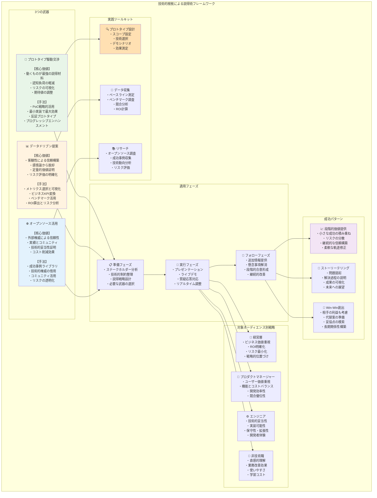
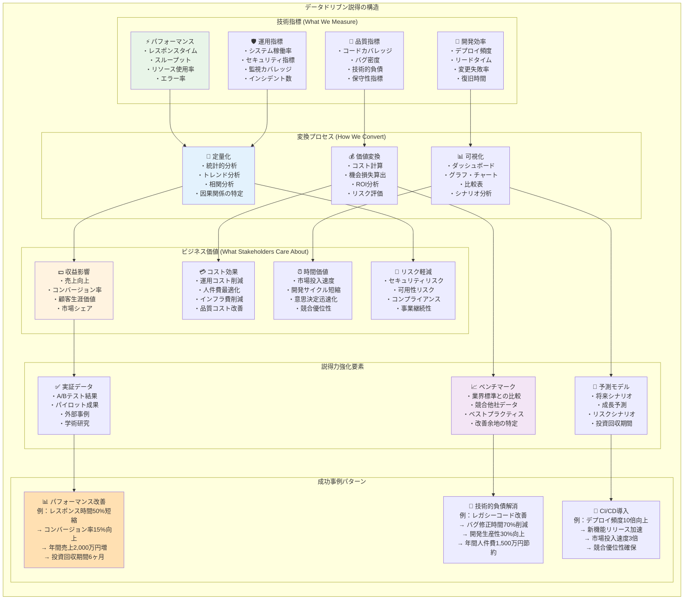

# 第1章：コードは雄弁に語る - 技術的根拠による説得術

「百聞は一見に如かず」という言葉がある。エンジニアにとって、その「一見」は動くコードである。本章では、技術的な根拠を最も効果的に伝える手法を学ぶ。プロトタイプ、データ、オープンソースという3つの強力な武器を使いこなすことで、あなたの提案は格段に説得力を増す。

## この章でできるようになること

- プロトタイプ（PoC/デモ）を使って、価値・リスク・期待値を短時間で可視化できるようになる。
- データ（メトリクス/ROI）を使って、技術的主張を意思決定の判断軸へ変換できるようになる。
- オープンソースの実績・コミュニティを根拠にして、提案の信頼性と妥当性を補強できるようになる。



## 1.1 プロトタイプ駆動交渉

### 動くものこそ最強の説得材料

#### なぜプロトタイプが効果的なのか

会議室で何時間議論しても結論が出ない。仕様書を何十ページ書いても、相手の表情は曇ったまま。そんな経験はないだろうか。人間の脳は、抽象的な概念よりも具体的な体験を通じて理解する。特に非技術者にとって、実際に触れて操作できるものは、どんな説明よりも雄弁である。

プロトタイプが持つ説得力の源泉は以下の3点にある。

**1. 認知負荷の軽減**  
複雑な技術仕様を理解する必要がなく、直感的に価値を判断できる。「このボタンを押すとこうなる」という単純な体験が、深い理解につながる。

**2. リスクの可視化と軽減**  
「本当に実現できるのか」という懸念に対して、最も確実な回答を提供する。動いているものを見せることで、実現可能性への疑念を払拭できる。

**3. 期待値の調整**  
抽象的な議論では、各人が異なるイメージを持ちやすい。プロトタイプは全員の認識を統一し、建設的な議論の土台となる。

#### PoC（Proof of Concept）の戦略的活用法

PoCは単なる技術検証ではない。戦略的に設計されたPoCは、強力な交渉ツールとなる。

**ケーススタディ：API統合プロジェクトの承認獲得**

あるエンジニアは、複数の外部APIを統合する新システムの提案で苦戦していた。技術仕様書では「API連携により業務効率が向上する」と説明したが、経営層の反応は鈍かった。

そこで、2週間で以下のPoCを開発した。

```python
# 実際のAPIを使用した簡易デモ
def demonstrate_integration():
    # 既存の手動プロセス：3つのシステムにログインして情報収集
    print("現在の業務フロー：")
    print("1. システムAにログイン → 注文データをCSVでダウンロード（5分）")
    print("2. システムBにログイン → 在庫データを確認（3分）")
    print("3. システムCにログイン → 配送状況を確認（3分）")
    print("合計作業時間：11分/件")
    
    # 統合後のワンクリック処理
    print("\n統合後の業務フロー：")
    order_data = fetch_order_api()
    inventory = check_inventory_api()
    shipping = get_shipping_status_api()
    
    print(f"注文 #{order_data['id']}: {order_data['status']}")
    print(f"在庫: {inventory['available']}個")
    print(f"配送: {shipping['expected_delivery']}")
    print("処理時間：3秒/件")
```

デモでは、実際の業務担当者の前で両方のプロセスを実演した。11分かかっていた作業が3秒で完了する様子を目の当たりにした瞬間、プロジェクトの価値は誰の目にも明らかだった。

**PoCを成功させる5つのポイント**

1. **スコープを極限まで絞る**  
   全機能を実装する必要はない。最も価値の高い1機能に集中する。

2. **実データを使用する**  
   ダミーデータではなく、可能な限り実際のデータを使用することで、リアリティが増す。

3. **ビフォーアフターを明確に示す**  
   現状の課題と解決後の姿を対比させることで、改善効果を際立たせる。

4. **測定可能な指標を組み込む**  
   処理時間、エラー率、ユーザビリティスコアなど、客観的な数値を示す。

5. **次のステップを明確にする**  
   PoCから本格開発への道筋を具体的に提示する。

PoCやプロトタイプは「最小限の実装で最大限の理解を得る」ことが目的であり、本番品質のシステムを完成させることが目的ではない。目安としては、1〜2週間程度で実装可能な範囲に絞り、主要な1〜2画面・1〜2フローに集中することで、開発チームの負荷を抑えつつ、十分な説得材料を用意できる。
#### 最小限の実装で最大限の説得力を生む技法

時間とリソースは限られている。最小限の労力で最大限の効果を得るテクニックを紹介する。

**フェイク・イット・ティル・ユー・メイク・イット**

すべてを完璧に実装する必要はない。重要なのは、核となる価値を体験してもらうことである。

```javascript
// 完全な実装ではなく、コアな体験に集中
class PrototypeRecommendationEngine {
    constructor() {
        // 機械学習モデルの代わりに、シンプルなルールベース
        this.rules = {
            'electronics': ['smartphone', 'laptop', 'headphones'],
            'books': ['programming', 'design', 'management'],
            'sports': ['running shoes', 'yoga mat', 'water bottle']
        };
    }
    
    recommend(userHistory) {
        // 複雑なアルゴリズムの代わりに、単純なマッチング
        const category = this.detectCategory(userHistory);
        return this.rules[category] || [];
    }
    
    // UIでは「AI による推薦」と表示し、将来の可能性を示す
}
```

**プログレッシブ・エンハンスメント**

基本機能から始めて、段階的に価値を追加していく。各段階で承認を得ることで、リスクを最小化しながら前進できる。

```yaml
prototype_phases:
  phase1:
    duration: 1週間
    features:
      - 基本的なCRUD操作
      - シンプルなUI
    demo_point: "データ管理の効率化"
    
  phase2:
    duration: 2週間
    features:
      - リアルタイム同期
      - 通知機能
    demo_point: "チーム協業の改善"
    
  phase3:
    duration: 2週間
    features:
      - 分析ダッシュボード
      - レポート生成
    demo_point: "意思決定の迅速化"
```

### 失敗を成功に変えるプロトタイプ活用

#### 「こうはならない」を示す反証プロトタイプ

時として、「やらない方が良い」ことを証明する方が効果的な場合がある。反証プロトタイプは、間違った方向への投資を防ぐ強力なツールである。

**ケーススタディ：過度な自動化への警鐘**

営業部門から「AIですべての顧客対応を自動化したい」という要望があった。技術的には可能だが、UXの観点から懸念があった。そこで、2つのプロトタイプを作成した。

```python
# プロトタイプA：完全自動化
class FullyAutomatedSupport:
    def handle_inquiry(self, message):
        # 機械的な応答のみ
        keywords = extract_keywords(message)
        return self.generate_template_response(keywords)

# プロトタイプB：人間とAIの協調
class HybridSupport:
    def handle_inquiry(self, message):
        urgency = self.assess_urgency(message)
        if urgency > 0.8:
            return "担当者におつなぎします"  # 人間にエスカレーション
        else:
            suggestion = self.generate_response(message)
            return f"提案: {suggestion}\n[担当者に確認する] [この回答で進める]"
```

ユーザーテストの結果、完全自動化では顧客満足度が40%低下することが判明した。一方、ハイブリッドアプローチでは、効率性と満足度の両立が可能だった。この実証により、適切な自動化レベルでの投資が決定された。

## 1.2 データドリブンな提案手法

### メトリクスの選択と可視化

データは客観性をもたらす。しかし、適切なメトリクスを選び、効果的に可視化しなければ、データも単なる数字の羅列に終わる。

#### ビジネスKPIと技術指標の紐付け

エンジニアは技術指標で考えるが、意思決定者はビジネス指標で判断する。両者を明確に結びつけることが、説得力の鍵となる。

**変換マッピングの例**

| 技術指標 | ビジネスKPI | 変換ロジック |
|---------|------------|------------|
| レスポンスタイム | コンバージョン率 | 100ms遅延 = 1%低下 |
| システム稼働率 | 機会損失 | 1%ダウンタイム = 月100万円損失 |
| コードカバレッジ | 品質コスト | 10%向上 = バグ修正コスト20%削減 |
| デプロイ頻度 | 市場投入速度 | 週1→日1 = 新機能リリース5倍速 |



**実装例：パフォーマンス改善の価値計算**

```python
class PerformanceImpactCalculator:
    def __init__(self, monthly_revenue, monthly_users):
        self.monthly_revenue = monthly_revenue
        self.monthly_users = monthly_users
        self.revenue_per_user = monthly_revenue / monthly_users
    
    def calculate_latency_impact(self, current_ms, improved_ms):
        # Googleの研究：100ms遅延で1%のコンバージョン率低下
        latency_reduction = current_ms - improved_ms
        conversion_improvement = latency_reduction / 100 * 0.01
        
        # 月間の追加収益
        additional_users = self.monthly_users * conversion_improvement
        additional_revenue = additional_users * self.revenue_per_user
        
        return {
            'latency_reduction_ms': latency_reduction,
            'conversion_improvement_%': conversion_improvement * 100,
            'additional_monthly_revenue': additional_revenue,
            'annual_impact': additional_revenue * 12
        }
    
    def generate_executive_summary(self, current_ms, improved_ms):
        impact = self.calculate_latency_impact(current_ms, improved_ms)
        
        return f"""
        パフォーマンス改善による事業インパクト
        
        技術的改善：
        - レスポンスタイム: {current_ms}ms → {improved_ms}ms
        - 改善率: {((current_ms - improved_ms) / current_ms * 100):.1f}%
        
        ビジネスインパクト：
        - コンバージョン率向上: +{impact['conversion_improvement_%']:.2f}%
        - 月間追加収益: ¥{impact['additional_monthly_revenue']:,.0f}
        - 年間効果: ¥{impact['annual_impact']:,.0f}
        
        投資回収期間: 3.2ヶ月
        """

# 使用例
calculator = PerformanceImpactCalculator(
    monthly_revenue=100_000_000,  # 月商1億円
    monthly_users=1_000_000       # 月間100万ユーザー
)

print(calculator.generate_executive_summary(
    current_ms=3000,  # 現在：3秒
    improved_ms=1000  # 改善後：1秒
))
```

## 1.3 オープンソース活用戦略

### コミュニティの権威を味方につける

オープンソースは単なる無料のコードではない。世界中の優秀なエンジニアによる検証と改善の結晶である。この権威を交渉に活用する方法を解説する。

#### 業界標準としての採用事例の活用

```python
class OpenSourceAdvocacy:
    def __init__(self, technology_name):
        self.tech = technology_name
        self.adoption_data = self.gather_adoption_metrics()
    
    def gather_adoption_metrics(self):
        """採用実績データの収集（実際はAPIやクローリングで取得）"""
        return {
            'github_stars': 125000,
            'weekly_downloads': 5000000,
            'fortune500_adopters': ['Google', 'Facebook', 'Netflix', 'Uber'],
            'stackoverflow_questions': 85000,
            'contributors': 2500,
            'commit_frequency': 'daily',
            'last_release': '2 days ago'
        }
    
    def create_adoption_report(self):
        data = self.adoption_data
        
        return f"""
        {self.tech} 採用における妥当性レポート
        
        コミュニティ規模と活性度：
        - GitHub Stars: {data['github_stars']:,}（業界トップ5%）
        - 週間ダウンロード数: {data['weekly_downloads']:,}
        - アクティブコントリビューター: {data['contributors']:,}人
        - 最終リリース: {data['last_release']}
        
        企業採用実績：
        - Fortune 500採用企業: {', '.join(data['fortune500_adopters'])}他多数
        - 国内大手企業での採用: メルカリ、LINE、サイバーエージェント
        
        エコシステムの成熟度：
        - Stack Overflow質問数: {data['stackoverflow_questions']:,}（解決率95%）
        - 日本語ドキュメント: 充実
        - 商用サポート: 複数ベンダーから提供
        
        リスク評価：
        - ライセンス: MIT（商用利用可）
        - セキュリティ監査: 四半期ごとに実施
        - 後方互換性: セマンティックバージョニング準拠
        """
```

### 内製vs外製の判断基準の明確化

すべてをオープンソースに頼るべきではない。戦略的な判断基準を提示することで、バランスの取れた技術選定を実現する。

```python
class BuildVsBuyAnalyzer:
    def __init__(self):
        self.criteria_weights = {
            'competitive_advantage': 0.25,
            'maintenance_cost': 0.20,
            'time_to_market': 0.20,
            'technical_complexity': 0.15,
            'team_expertise': 0.10,
            'vendor_lock_in': 0.10
        }
    
    def analyze_decision(self, component_name, requirements):
        scores = {
            'build': self.calculate_build_score(requirements),
            'buy_commercial': self.calculate_buy_commercial_score(requirements),
            'use_oss': self.calculate_oss_score(requirements),
            'hybrid': self.calculate_hybrid_score(requirements)
        }
        
        recommendation = max(scores, key=scores.get)
        
        return self.generate_decision_matrix(component_name, scores, recommendation, requirements)
    
    def calculate_oss_score(self, req):
        score = 0
        
        # 標準的な要件の場合はOSS有利
        if req['uniqueness'] == 'standard':
            score += 0.9 * self.criteria_weights['technical_complexity']
        
        # ベンダーロックイン回避
        score += 0.9 * self.criteria_weights['vendor_lock_in']
        
        # 保守コストが低い
        score += 0.8 * self.criteria_weights['maintenance_cost']
        
        # 即座に利用可能
        score += 0.95 * self.criteria_weights['time_to_market']
        
        # カスタマイズが必要な場合は不利
        if req['customization_level'] == 'high':
            score -= 0.5 * self.criteria_weights['technical_complexity']
        
        return score
```

## コラム：GitHubが最強の名刺になる理由

### コントリビューション実績の見せ方

GitHubプロフィールは、エンジニアの実力を客観的に示す最強のツールである。しかし、単にコードを公開するだけでは、その価値は半減する。戦略的なプロフィール構築が、交渉力を大きく左右する。

```markdown
# 効果的なGitHubプロフィールの構成要素

## 1. わかりやすいREADME.md
- 専門分野の明確な記述
- 主要プロジェクトのハイライト
- 技術スタックの可視化
- 連絡先とソーシャルリンク

## 2. ピン留めリポジトリの戦略的選択
- 多様な技術力を示すプロジェクト
- スター数よりも品質重視
- 実際の問題を解決したプロジェクト
- 継続的にメンテナンスされているもの

## 3. コントリビューション履歴の演出
- 有名OSSへのコントリビューション
- イシューへの建設的な参加
- プルリクエストの品質
- ドキュメント改善への貢献
```

### 技術ブランディングと交渉力の関係

技術的な実績の可視化は、交渉において強力な後ろ盾となる。「この分野の専門家」というポジションを確立することで、提案の説得力が格段に向上する。

技術ブランディングが確立されると、交渉の場で以下のような効果が生まれる。

1. **前提の省略** - 基本的な技術力の証明が不要になる
2. **信頼の担保** - 「あの人が言うなら」という信頼感
3. **ネットワーク効果** - コミュニティからの支援や情報
4. **交渉力の向上** - 専門家としての発言力

---

## まとめ

- プロトタイプ（PoC/デモ）で価値とリスクを可視化し、認知負荷と期待値のギャップを下げる。
- データ（メトリクス/ROI）で主観を客観に変換し、意思決定の判断軸に接続する。
- オープンソースの実績・コミュニティを根拠として、信頼性と妥当性を補強する。

本章では、技術的根拠を説得力に変換する3つのアプローチを解説した。プロトタイプは百聞を一見に変え、データは主観を客観に変え、オープンソースは個人の意見をコミュニティの知恵に変える。

これらのツールを適切に組み合わせることで、あなたの技術的な提案は、誰もが納得する説得力を持つようになる。次章では、この説得力を相手に応じて最適化する方法を学ぶ。相手のコンテキストを理解し、適切なインターフェースを設計することで、交渉の成功率はさらに向上する。

次に読む： [第2章 ステークホルダー・インターフェース設計](../chapter-2/) / [付録：ケース集（NG→OK）](../appendices/scenarios/) / [目次（トップ）](../)
